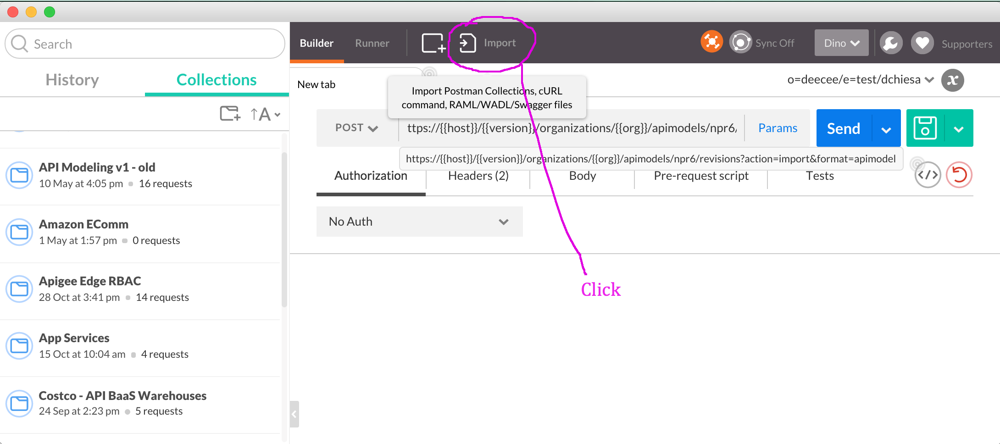

# HMAC Example proxy

This api proxy shows how to use a custom Java callout that calculates HMACs.

What's an HMAC?  https://en.wikipedia.org/wiki/HMAC

Typically you'd use an HMAC to sign a message, or verify a signature on
a message.

Apigee Edge doesn't currently contain "built-in" capability to create or
calculate HMACs on arbitrary payloads. This proxy shows how to use a
simple Java callout to do that.

You can take advantage of this callout without knowing Java and without
any additional coding. Just drop the policy into your API proxy and go.
This API Proxy demonstrates how you can do that.


## Invoking


### Generate an hmac on the request body

Generate an HMAC on a given payload using alg=sha-256, with key secret123:

```
curl -i -X POST -d 'the quick brown fox...' \
   "https://$ORG-$ENV.apigee.net/hmac/payload?alg=sha-256&key=secret123"
```

The response is plain text like this:

```
string-to-sign: the quick brown fox...
algorithm: sha-256
javaized algorithm: HmacSHA256
signature-hex: bf41d260dacd49be2d09e7c80f0cb5614bce8997c7a371994daafd606a6c4e2f
signature-b64: v0HSYNrNSb4tCefIDwy1YUvOiZfHo3GZTar9YGpsTi8=
```

Of course you can replace the payload with any value you like. You will see a different HMAC for each different payload value.


### Validating

You can validate an hmac by specifying the hmac-base64 header and invoking a different url path, like this:


```
curl -i -X POST -d 'the quick brown fox...' \
   -H "hmac-base64 : v0HSYNrNSb4tCefIDwy1YUvOiZfHo3GZTar9YGpsTi8=" \
   "https://$ORG-$ENV.apigee.net/hmac/validate-payload?alg=sha-256&key=secret123"
```

You will get a 400 error if the provided signature does not match what is calculated by the proxy.


### Generating HMAC on compound Strings


This proxy also has an endpoint that will compute an HMAC on the concatenation of various headers and other values in the message. Invoke it from curl like this:

```
curl -i -X POST -d '' \
   -H "Date:`date -u +'%a, %d %b %Y %H:%M:%S GMT'`" \
   "https://$ORG-$ENV.apigee.net/hmac/headers?alg=sha-256&key=secret123"
```

The incantation around the Date header just creates a date string that
looks like "Wed, 07 Oct 2015 21:10:19 GMT", which is compliant with
RFC-1123, and which is the format that browsers and other web clients
use to send Date headers to servers.  The result of this call looks like
this:

```
string-to-sign: Wed, 07 Oct 2015 21:10:19 GMT|POST|iloveapis2015-test.apigee.net|/hmac/headers?alg=sha-256&key=secret123
algorithm: sha-256
javaized algorithm: HmacSHA256
signature-hex: 2d9af1e471d593854627afef4b83332f59cccc4d0e21b1392f239324e480abd6
signature-b64: LZrx5HHVk4VGJ6/vS4MzL1nMzE0OIbE5LyOTJOSAq9Y=

```

### Help

Finally, you can get help on this demonstration API Proxy like this:

```
    curl -i -X GET  https://$ORG-$ENV.apigee.net/hmac
```

### Using Postman

For those of you who use [Google's free POSTMAN tool](https://www.getpostman.com/) for sending API requests, you can download a Postman collection for this proxy [here](https://www.getpostman.com/collections/4b8e201e407a7e06fd7c).

To import this collection into Postman, first install and run the Postman tool.

Then, Click the button to import a collection.



Then, specify the URL location (https://www.getpostman.com/collections/4b8e201e407a7e06fd7c)


Usage Notes:
============

There are two ways to use this callout: for verification and for HMAC creation.
Either way, it works the same: you will use the Java callout to perform HMAC
calculation. For verification, you'd then compare the result to the passed-in
signature; the callout does this for you automatically if you pass in the
hmac-base64 property. For signature creation, you'd send the resulting
signature in a message to the backend.
